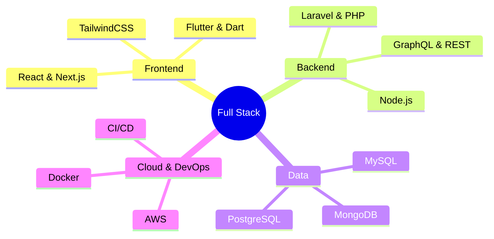

<div align="center">

<!-- Animated Header -->


<!-- Typing SVG -->
<a href="https://git.io/typing-svg"></a>

<!-- Profile Badges -->
<p>
  <a href="https://www.linkedin.com/in/izzuuuuu/">
    
  </a>
  <a href="https://www.instagram.com/izzuuuuu_">
    
  </a>
  <a href="mailto:muhammadizzuddin4600@gmail.com">
    
  </a>
</p>

<!-- Profile Views -->


</div>

<!-- Divider -->


<br>

##  About Me

<div align="center">


<div align="left" style="width: 50%;">

<table>
<tr>
<td>

### 👨‍💻 Quick Info

```yaml
name: Muhammad Izzuddin
role: Full Stack Developer
location: Malaysia 🇲🇾
languages: [HTML, CSS, TypeScript, JavaScript, PHP, Python, Dart]
current_focus:
  - AI/ML Integration
  - Web3 Development
  - System Design
```

</td>
</tr>

<tr>
<td>

### 🎯 What I'm Up To

🔭 **Currently:** Building AI-powered web applications  
🌱 **Learning:** Advanced System Design & Cloud Architecture  
👯 **Open to:** Collaborate on Open Source Projects  
💬 **Ask me about:** Full Stack Dev, AI/ML, Web3  
⚡ **Fun fact:** I debug with console.log() 🐛  

</td>
</tr>

<tr>
<td>

### 💼 Specialties

<div align="center">



</div>

</td>
</tr>
</table>

</div>

<br clear="both"/>

<br>

<!-- Divider -->


## 🚀 Tech Stack

<div align="center">

<table>
<tr>
<td align="center" width="25%">
<br/>
<sub><b>Frontend</b></sub>
</td>
<td align="center" width="25%">
<br/>
<sub><b>Backend</b></sub>
</td>
<td align="center" width="25%">
<br/>
<sub><b>Database</b></sub>
</td>
<td align="center" width="25%">
<br/>
<sub><b>DevOps & Tools</b></sub>
</td>
</tr>
</table>

<br>

**Additional Skills:**
<p>


</p>

</div>

<br>
<br>

<!-- Divider -->


## 💼 Featured Projects

<div align="center">

| 🛣️ **RoadFix** | ✈️ **TravelMate** |
|:---:|:---:|
| [](https://roadfix.me) | [](https://github.com/ayieeez/TravelMate) |
| *Infrastructure monitoring for road maintenance* | *Location-based app with weather, maps, currency & news* |
|   |    |
| **🏥 CareTrack** | **🚗 RevCar** |
| [](https://github.com/ayieeez/CareTrack-Apps) | [](https://revcar.onrender.com/) |
| *Healthcare management & patient tracking* | *Modern vehicle rental platform* |
|   |    |

</div>

<br>

<!-- Divider -->


## 📊 GitHub Analytics

<div align="center">
  
  
</div>

<div align="center">
  
</div>

<br>

### 📈 Contribution Graph

<div align="center">
  
</div>

<br>

### 🐍 Contribution Snake

<div align="center">
  
</div>

<br>

<!-- Divider -->


##  GitHub Trophies

<div align="center">
  
</div>

<br>

### 📈 Activity

<!--START_SECTION:activity-->
<!--END_SECTION:activity-->

---

<div align="center">

## � Let's Connect & Collaborate

 <em><b>I love connecting with different people</b> so if you want to say <b>hi, I'll be happy to meet you!</b> 😊</em>

<br><br>

### 💡 Open for:
- 🤝 Collaborating on innovative projects
- 💼 Freelance opportunities
- 🎯 Tech discussions and knowledge sharing
- 🚀 Startup ideas and ventures

<br>

**📧 Reach me at:** [muhammadizzuddin4600@gmail.com](mailto:muhammadizzuddin4600@gmail.com)

</div>

<br>

<!-- Divider -->


<div align="center">

### 💭 Developer Quote


<br><br>

---

<sub>⭐️ From [ayieeez](https://github.com/ayieeez) | Crafted with 💙 and ☕ | © 2025</sub>

</div>

<!-- Footer Wave -->

