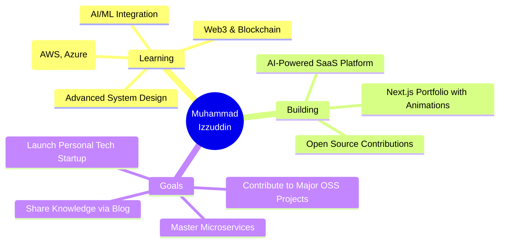

<div align="center">

<!-- Animated Header -->


<!-- Typing SVG -->
<a href="https://git.io/typing-svg"></a>

<!-- Profile Badges -->
<p>
  <a href="https://www.linkedin.com/in/izzuuuuu/">
    
  </a>
  <a href="https://www.instagram.com/izzuuuuu_">
    
  </a>
  <a href="mailto:muhammadizzuddin4600@gmail.com">
    
  </a>
</p>

<!-- Profile Views -->


</div>

<!-- Divider -->


<br>

##  About Me


```typescript
interface Developer {
  name: string;
  role: string;
  location: string;
  code: string[];
  technologies: {
    frontend: string[];
    backend: string[];
    database: string[];
    tools: string[];
  };
  currentFocus: string[];
  funFact: string;
}

const ayieeez: Developer = {
  name: "Muhammad Izzuddin",
  role: "Full Stack Developer",
  location: "Cyberjaya, Malaysia 🇲🇾",
  code: ["TypeScript", "JavaScript", "PHP", "Python", "Dart"],
  technologies: {
    frontend: ["React", "Next.js", "Flutter", "TailwindCSS"],
    backend: ["Laravel", "Node.js", "GraphQL", "REST APIs"],
    database: ["MySQL", "MongoDB", "PostgreSQL"],
    tools: ["Git", "Docker", "Nginx", "AWS"]
  },
  currentFocus: ["AI/ML Integration", "Web3 Development", "System Design"],
  funFact: "I debug with console.log() and I'm not ashamed! 🐛"
};
```

<br clear="right"/>

- 🔭 Currently working on **AI-powered web applications**
- 🌱 Learning **Advanced System Design & Cloud Architecture**
- 👯 Open to collaborate on **Open Source Projects**
- 💬 Ask me about **Full Stack Development, AI/ML, Web3**
- ⚡ Fun fact: **I turn coffee into code** ☕→💻

<br>

<!-- Divider -->


## � Tech Arsenal

<div align="center">

### Frontend Development
<p>
  
  
  
  
  
  
  
  
</p>

### Backend Development
<p>
  
  
  
  
  
  
</p>

### Database & Cloud
<p>
  
  
  
  
  
</p>

### Tools & DevOps
<p>
  
  
  
  
  
  
</p>

</div>

<br>

<!-- Divider -->


## � Featured Projects

<div align="center">

<table>
<tr>
<td width="50%">

### 🛣️ RoadFix
[](https://roadfix.me)

**Infrastructure monitoring system for road maintenance and reporting**

`Laravel` `MySQL` `Google Maps API` `Real-time Tracking`

🎯 Smart reporting system with geolocation
📊 Analytics dashboard for maintenance tracking
🗺️ Interactive map visualization

</td>
<td width="50%">

### ✈️ TravelMate
[](https://github.com/ayieeez/TravelMate)

**Smart travel planning companion with real-time recommendations**

`Flutter` `Node.js` `MongoDB` `AI Recommendations`

🌍 Personalized travel suggestions
📱 Cross-platform mobile app
🤖 AI-powered itinerary planning

</td>
</tr>

<tr>
<td width="50%">

### 🏥 CareTrack
[](https://github.com/ayieeez/CareTrack-Apps)

**Healthcare management system for patient tracking and appointments**

`Flutter` `RESTful API` `MySQL` `Appointment System`

👨‍⚕️ Patient management portal
📅 Smart appointment scheduling
📊 Health records tracking

</td>
<td width="50%">

### 🚗 RevCar
[](https://github.com/ayieeez/RevCar)

**Vehicle rental platform with booking management system**

`HTML` `CSS` `JavaScript` `Responsive Design`

🚘 Online vehicle booking system
💳 Payment integration
📱 Mobile-responsive interface

</td>
</tr>
</table>

</div>

<br>

<!-- Divider -->


## 📊 GitHub Analytics

<div align="center">
  
  
</div>

<div align="center">
  
</div>

<br>

### 📈 Contribution Graph

<div align="center">
  
</div>

<br>

### 🐍 Contribution Snake

<div align="center">
  <picture>
    <source media="(prefers-color-scheme: dark)" srcset="https://github.com/ayieeez/ayieeez/blob/output/github-contribution-grid-snake-dark.svg">
    <source media="(prefers-color-scheme: light)" srcset="https://github.com/ayieeez/ayieeez/blob/output/github-contribution-grid-snake.svg">
    
  </picture>
</div>

<br>

<!-- Divider -->


## 🎯 Current Objectives

<div align="center">



</div>

<br>

**🔥 Active Focus Areas:**
- 🤖 Building AI-powered web applications with GPT integration
- ⚡ Creating high-performance Next.js applications
- 🌐 Exploring Web3 and decentralized applications
- 📚 Contributing to open-source projects
- 🎨 Mastering advanced UI/UX animations and interactions

<br>

<!-- Divider -->


## 🏆 GitHub Trophies

<div align="center">
  
</div>

<br>

### 📈 Activity

<!--START_SECTION:activity-->
<!--END_SECTION:activity-->

---

<div align="center">

## � Let's Connect & Collaborate

 <em><b>I love connecting with different people</b> so if you want to say <b>hi, I'll be happy to meet you!</b> 😊</em>

<br><br>

### 💡 Open for:
- 🤝 Collaborating on innovative projects
- 💼 Freelance opportunities
- 🎯 Tech discussions and knowledge sharing
- 🚀 Startup ideas and ventures

<br>

**📧 Reach me at:** [muhammadizzuddin4600@gmail.com](mailto:muhammadizzuddin4600@gmail.com)

<br>

### ☕ Support My Work

If you like my work and want to support me:

<a href="https://www.buymeacoffee.com/ayieeez" target="_blank">
  
</a>

</div>

<br>

<!-- Divider -->


<div align="center">

### 💭 Quote of the Day


<br><br>

### 🎵 Spotify Playing

[](https://open.spotify.com/user/31k6gdvqfepz2rg3qluhr5cj7yaq)

<br>

---

<sub>⭐️ From [ayieeez](https://github.com/ayieeez) | Built with 💙 and ☕ | Last Updated: 2025</sub>

</div>

<!-- Footer Wave -->

